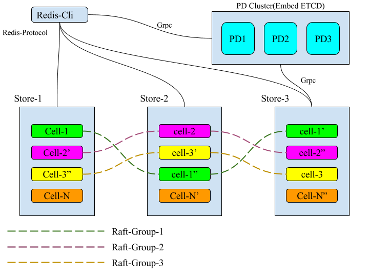

## What is Elasticell?

Elasticell key-value storage with strong consistency and reliability.

## Roadmap

Read the [Roadmap](./docs/ROADMAP.md).

## Quick start

Read the [Quick Start](./docs/QUICKSTART.md)

## Documentation

+ [English](http://elasticell.readthedocs.io/en/latest/)
+ [简体中文](http://elasticell.readthedocs.io/zh/latest/)

## Architecture

## Contributing

TODO

## License

Elasticell is under the Apache 2.0 license. See the [LICENSE](./LICENSE) file for details.

## Acknowledgments

- Thanks [etcd](https://github.com/coreos/etcd) for providing the raft implementation.
- Thanks [tidb](https://github.com/pingcap/tidb) for providing the multi-raft implementation.
- Thanks [RocksDB](https://github.com/facebook/rocksdb) for their powerful storage engines.