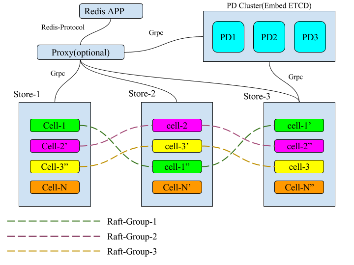

## Multi-Raft

### Why Multi-Raft
In the raft, only the leader node provides read and write operation. This measns:

* The more nodes, the worse the performance
* The system storage capacity depends on the size of the leader machine's disk

Obviously, the solution for a single raft group is not suitable for Elasticell.

### What is Multi-Raft
Multi-Raft is multiple raft group, and each raft group responsible for managing data in the range [start, end). 

As a Key-Value NoSQL, all of the keys are orderly. According to the Key dictionary order to divide the data into multiple ranges. In the Elasticell, these ranges corresponded cells.

A cell has peers in the different stores, each cell's peers makes up a raft group. As you see raft group 1, 2 and 3 in the figure above.

### How Multi-Raft works

Multi-Raft is in charge of the following operations:

* Add cell peer
* Remove cell peer
* Split cell
* Transfer cell Leader

All these operation is scheduled by PD.

#### Add cell peer
If PD found the count of cell's peers is less than the threshold value, PD will select a best store, and dispatch add peer operation to the cell leader. 

#### Remove cell peer
If PD found one of cell's peer is offline. PD will dispatch remove peer operation to the cell leader.

#### Split cell
If leader found the current cell is too bigger, it will start a split operation, and tell the newest metadata to PD after split.

After split, the new cell only has one peer, and after some heartbeats, PD will dispatch add peer operation on the newest cell until the count of newest cell's peers equals the threshold value.

### How Multi-Raft makes rebalance
The rebalance contains the following two things: 

* Data storage balance
* Read/Write operation balance

#### Data storage balance
Each cell manage data in the range [start, end). 

Store ensure that the data within each range corresponds to the storage space is roughly equal.

PD ensure that cells count in each store is roughly equal. If not roughly equal, PD will dispatch remove and add peer operation to ensure roughly equal.

#### Read/Write operation balance
PD ensure that leader count of cells in each store is roughly equal. If not roughly equal, PD will dispatch transfer leader operation to ensure roughly equal.
